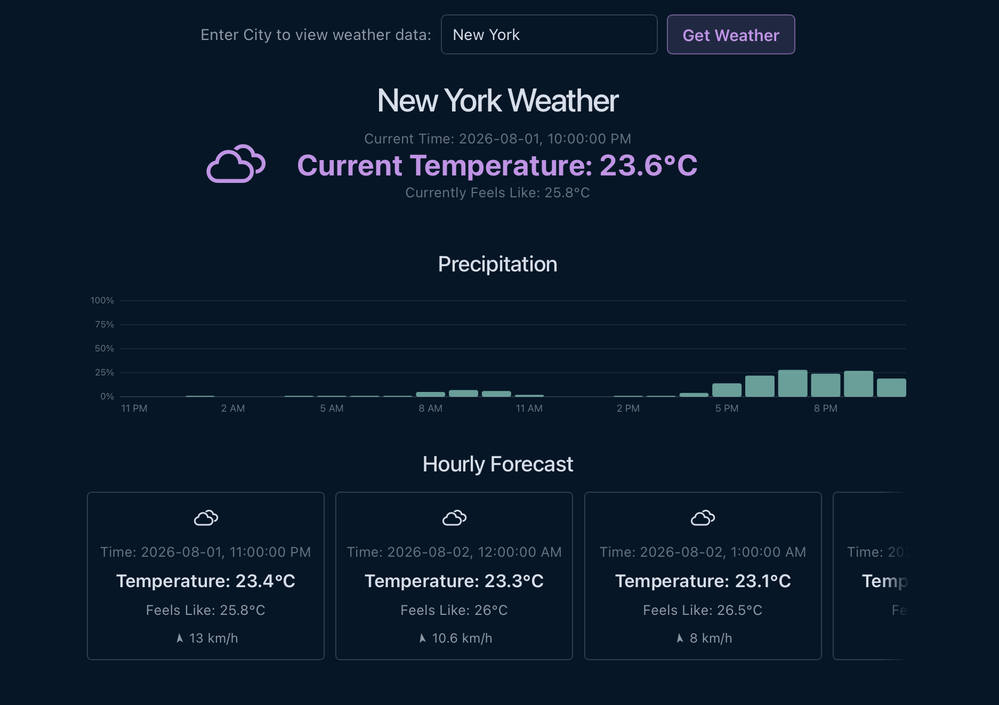

# Weather App

A full-stack weather app built to learn what it actually takes to connect a frontend to a backend, handle real API data end-to-end, and understand the React component lifecycle well enough to explain it in an interview.

It detects your location on load and fetches live weather data immediately. You can also search any city by name. Either way, you get current conditions and a 24-hour hourly forecast pulled from the Open-Meteo API, no API key required.

**Live:** [reinerumila-weatherproject.netlify.app](https://reinerumila-weatherproject.netlify.app) · backend deployed on Render



---

## How it works

### The backend

The backend is a FastAPI server with two endpoints. `/weather` takes a city name as a query parameter, geocodes it to coordinates via Geopy's Nominatim wrapper around the OpenStreetMap API, then calls Open-Meteo for live weather data. `/coordinates` does the reverse: it accepts a latitude and longitude from the browser's Geolocation API, reverse geocodes it to a readable city name at town or borough zoom level, and returns the same structured response.

Both endpoints return a `WeatherResponse` object validated by Pydantic. The schema includes a `CurrentWeather` model for present conditions and a `list[HourlyWeather]` for the next 24 hours. Type validation at the response boundary means the frontend can trust what it receives.

The hourly data pipeline runs through pandas. Open-Meteo returns timestamps in UTC; the backend converts them to the location's local timezone using the `timezone: auto` parameter, filters out past hours, and slices the next 24, keeping the payload small and relevant. The resulting DataFrame is serialized to a list of records and passed into the response model directly.

CORS middleware is configured on the FastAPI app to permit cross-origin requests from the Vite dev server during development and from the deployed frontend in production.

### The frontend

The frontend is built with Vite and React. The main component manages five pieces of state: the weather data itself, a loading flag, an error message, the current city string, and the raw user input in the search box. Separating `userInput` from `city` is deliberate: it prevents the API from being called on every keystroke, since `city` only updates on form submission, and the `useEffect` watching it only fires when that value actually changes.

There are two `useEffect` hooks. The first runs once on mount with an empty dependency array and invokes the browser's Geolocation API. If the user grants permission, it hits the `/coordinates` endpoint and populates the component with their local weather right away. The second hook watches `city` and calls the `/weather` endpoint whenever a new city is submitted. If `city` is empty, it returns early, preventing it from overriding the geolocation result that just loaded.

Loading and error states render conditionally inline using `&&` operators, which is the idiomatic React pattern for conditional rendering. The 24-hour hourly forecast is rendered by mapping over `data.hourly`, using `entry.date` as the `key` prop since each timestamp in the window is unique.

Styling is split between `index.css` for global tokens and layout and `App.css` for component-level styles. The global stylesheet defines a full set of CSS custom properties at `:root` for colours, typography, and shadows, with a `prefers-color-scheme: dark` block that swaps the palette automatically based on the user's system preference. The dark palette matches the Night Owl theme used on my portfolio site, sharing exact colour values (`#011627` background, `#d6deeb` foreground, `#c792ea` accent) so this project's screenshot sits naturally alongside the rest of the site. Layout mixes flexbox and CSS Grid depending on what each piece needs: the hourly forecast is a horizontally snap-scrolling flex row (with a `mask-image` edge fade and themed scrollbar), while the current-conditions hero uses a symmetric three-column grid (`icon | text | invisible spacer matching the icon's width`) so the text stays centered on the page regardless of the icon's footprint. A flex row centering "icon + text" as one unit doesn't achieve that on its own.

Weather condition icons come from the `weather-icons-master` SVG set, mapped from Open-Meteo's WMO weather codes in `weatherIcons.js`. Vite's `import.meta.glob` eagerly loads the relevant SVGs as raw markup at build time, keyed by filename, so there's no need for a static import line per icon. The icons themselves ship with no `fill` attribute (defaulting to black), so they're injected as inline markup via `dangerouslySetInnerHTML` rather than referenced with an `` tag: an `` can't be recoloured by page CSS, but injected SVG elements can, via `fill: currentColor` on the `<path>` targeted from `App.css`. That's what lets the icons follow the theme's accent colour instead of rendering as flat black shapes.

Wind direction is drawn as a small arrow rotated with a CSS `transform`, using each hour's `wind_direction` value directly. Since Open-Meteo reports the compass bearing wind is blowing *from*, the rotation adds 180° so the arrow visually points toward where the wind is actually heading. Precipitation probability is charted in `PrecipitationChart.jsx` as a hand-rolled SVG bar chart with a labelled 0–100% value axis, rather than pulling in a charting library. With ~24 data points and one metric, mapping probability linearly into pixel height is simple enough to not need one.

Understanding what `index.css` actually is and how it relates to component stylesheets, getting flexbox to behave, and later working out the CSS Grid centering trick, were all things that had to be figured out here.

---

## Project structure

```
backend/
  main.py           : FastAPI app, CORS config, /weather and /coordinates endpoints
  weather.py        : Open-Meteo API client, current and hourly data processing
  models.py         : Pydantic models: WeatherResponse, CurrentWeather, HourlyWeather
  requirements.txt

frontend/
  src/
    App.jsx                : Main component: weather fetch logic, state management, render
    App.css                : Component styles
    index.css               : Global styles, CSS custom properties, dark mode
    weatherIcons.js         : WMO weather code -> icon filename mapping
    PrecipitationChart.jsx  : Hand-rolled SVG bar chart for hourly precip probability
    assets/
      weather_icons/        : weather-icons-master SVG set
  index.html
  vite.config.js
  package.json
```

---

## Running it

Both processes need to run simultaneously in separate terminals.

**Backend** (from the `/backend` directory):

```bash
# First-time setup: install dependencies
pip install -r requirements.txt

# Activate the virtual environment, then start the server:
source ~/venv/bin/activate
uvicorn main:app --reload
```

**Frontend** (from the `/frontend` directory; use a second terminal, e.g. the integrated one in VSCode):

```bash
npm install   # first-time setup: installs React, Vite, and all JS dependencies
npm run dev
```

The backend runs on port 8000 and the frontend on 5173. Open-Meteo is free with no API key required.

---

## What this project taught me

This started as a throwaway single-file Python script: it asked for a location in the terminal, called the Open-Meteo API, and printed a pandas DataFrame onto the terminal. The whole point was to shake off some rust with pandas, get comfortable parsing real JSON from an external API, and move on. Months later, it called back to me, and now it became this.

Coming from that script, and from the Block Blast Solver, which also lived entirely in Python with no network layer, this was the first time I had to think seriously about what it means to have two separate processes talking to each other. That meant learning FastAPI, including how route and query parameters work, how Pydantic enforces response shapes at runtime, and what CORS is and why browsers enforce it at all.

React was entirely new territory. The component lifecycle, the rules around hooks, why you cannot call a hook conditionally, why the dependency array matters, and what a re-render actually means in practice: all of that had to be understood before any of it worked. The dual `useEffect` pattern in particular required careful reasoning about execution order and state dependencies to get right.

Working with real API data also introduced problems that do not exist in toy examples: timezone conversion, filtering stale rows from a DataFrame, graceful handling of geocoding failures, and making sure the frontend does not fire redundant requests. Each one was its own small problem to sit with and solve.

Coming back to this months later for a frontend pass taught a different kind of lesson than the initial build did. It's less about learning a new framework, or even knowing how to read older code I've written but since forgot, and more about the payoff of decisions made earlier. Every piece of data used in this refresh (weather codes, wind, precipitation) was already sitting in the backend response from the original build, so the entire session was frontend-only with zero backend changes. That made a strong case for designing an API response around what the data *could* support, not just what the UI happened to render on day one. On the frontend side specifically: Vite's `import.meta.glob` for pulling in a whole folder of assets without a manual import per file, `currentColor` as the trick that makes SVG icons theme-able at all, and the realization that a hand-rolled SVG chart with about ~20 lines of coordinate math is often less work, and easier to explain, than reaching for a charting library/framework I then need to cover when asked during an interview.

---

## What's next

Day/night icon variants, switching based on Open-Meteo sunrise/sunset times; the mapping in `weatherIcons.js` already has night-variant filenames ready to go, but the backend doesn't fetch sunrise/sunset yet, so that's the next real backend change (the first since this project's frontend refresh). Beyond that: additional hourly graphs (temperature, wind speed), ambient gradient backgrounds based on local time of day, and Dockerizing the backend as a deployment and portfolio talking point.
